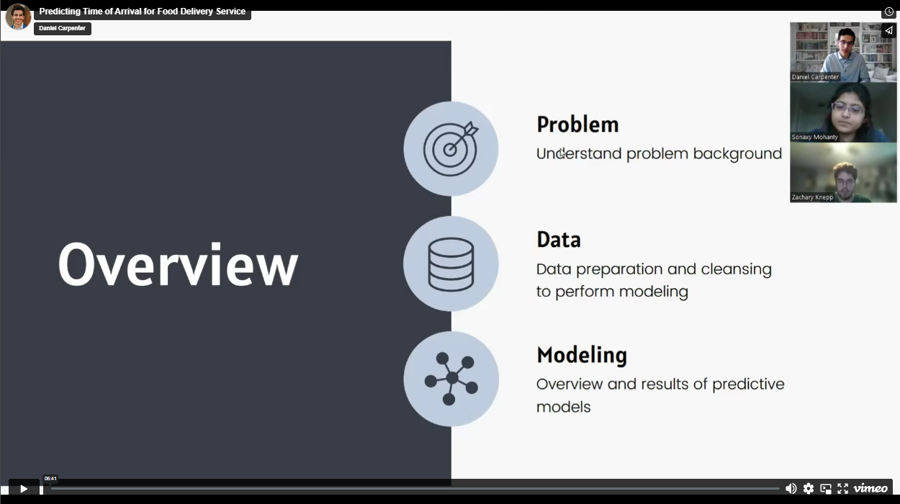

# Predicting Time of Arrival for Food Delivery Service 
> Daniel Carpenter, Sonaxy Mohanty, and Zach Knepp  
> Initelligent Data Analytics - Final Project  
> December 2022  

## Presentation

## Overview
This detailed analysis aims to predict estimated delivery times for a food delivery service. A firm can give
the option for delivering the food to a customer’s house; using current technology, the
company may give the consumer an estimated time of arrival to help manage their
expectations, which could lead to enhanced retention of customers for future orders.
Companies like DoorDash or GrubHub give customers an estimated time of delivery for food
and beverage orders. Most consumers may expect a few conditions to affect the time to
deliver, but there may be many circumstances that impact the delivery time. For example, if the
algorithm knows that there is a crash impeding traffic between the major routes of the
customer and the delivery service, then that may impact the transport time. Additionally,
severe weather may delay the ability of a driver to deliver the food to the destination. Overall,
providing accurate estimates to the customer will help manage expectations, which may lead to
retained customers.

 

## Quick Links
1. [Presentation Slides](1%20-%20Presentation%20Slides/IDA-Final-Presentation%20-%20Submission.pdf)
2. [PDF Report](2%20-%20Final%20Report/Carpenter_Mohanty_Knepp_FinalReport.pdf)
3. [`R` Code](2%20-%20Final%20Report/FinalModel.Rmd)
